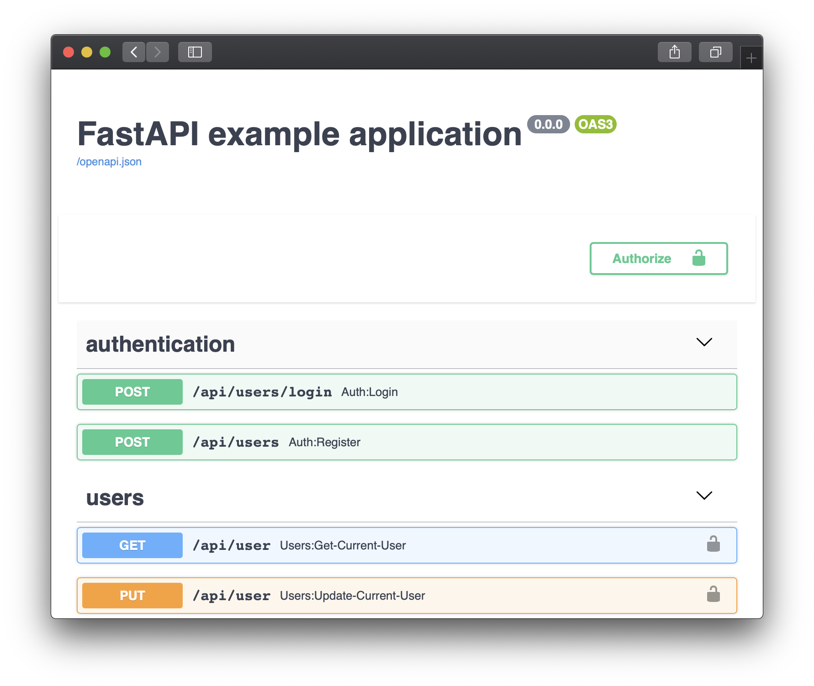

.. |app| replace:: FastAPI
.. |mod| replace:: Python 3.6+
.. |app-pip-package| replace:: fastapi
.. |app-pip-link| replace:: PIP package
.. _app-pip-link: https://fastapi.tiangolo.com/tutorial/#install-fastapi

#######
FastAPI
#######

To run apps built with the `FastAPI
<https://fastapi.tiangolo.com>`_ web framework using Unit:

#. .. include:: ../include/howto_install_unit.rst

#. .. include:: ../include/howto_install_venv.rst

#. Let's try a version of a `tutorial app
   <https://fastapi.tiangolo.com/tutorial/first-steps/>`_,
   saving it as **/path/to/app/asgi.py**:

   .. code-block:: python

      from fastapi import FastAPI

      app = FastAPI()

      @app.get("/")
      async def root():
          return {"message": "Hello, World!"}

   .. note::

      For something more true-to-life, try the
      `RealWorld example app
      <https://github.com/nsidnev/fastapi-realworld-example-app>`_; just
      install all its dependencies in the same virtual environment where you've
      installed |app| and add the app's **environment** :ref:`variables
      <configuration-apps-common>` like **DB_CONNECTION** or
      **SECRET_KEY** directly to the app configuration in Unit instead of
      the **.env** file.

#. .. include:: ../include/howto_change_ownership.rst

#. Next, :ref:`prepare <configuration-python>` the |app| configuration for
   Unit (use real values for **type**, **home**, and **path**):

   .. code-block:: json

      {
          "listeners": {
              "*:80": {
                  "pass": "applications/fastapi"
              }
          },

          "applications": {
              "fastapi": {
                  "type": "python 3.:nxt_ph:`Y <Must match language module version and virtual environment version>`",
                  "path": ":nxt_ph:`/path/to/app/ <Path to the ASGI module>`",
                  "home": ":nxt_ph:`/path/to/app/venv/ <Path to the virtual environment, if any>`",
                  "module": ":nxt_hint:`asgi <ASGI module filename with extension omitted>`",
                  "callable": ":nxt_hint:`app <Name of the callable in the module to run>`"
              }
          }
      }

#. .. include:: ../include/howto_upload_config.rst

   After a successful update, your app should be available on the listener’s IP
   address and port:

   .. code-block:: console

      $ curl http://localhost

            Hello, World!

   Alternatively, try |app|'s nifty self-documenting features:

